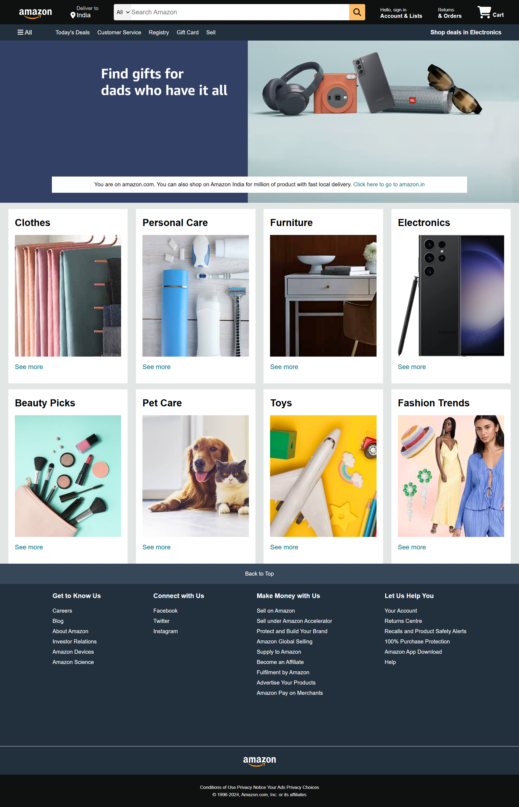

# Amazon Clone 🌐

# Project Details :
- PROJECT TITLE      : Amazon Clone 

# 🚀Features :
✅ Responsive Design

✅ Clean & Modern UI

✅ Organized HTML structure

✅ Styled with pure CSS (no frameworks)

✅ Includes navigation bar, category sections, and footer

# Project Description : 
A simple and Amazon Clone built using HTML & CSS. This project replicates Amazon's homepage layout, design, and user interface for learning and practice purposes.

# Technologies Used :
1. HTML5 for structuring content
2. CSS3 for styling and layout

# 📸 Project Preview :

